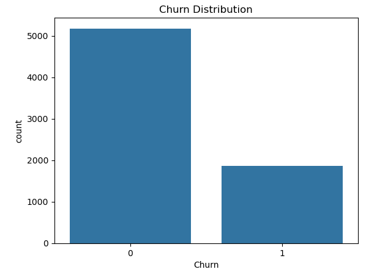
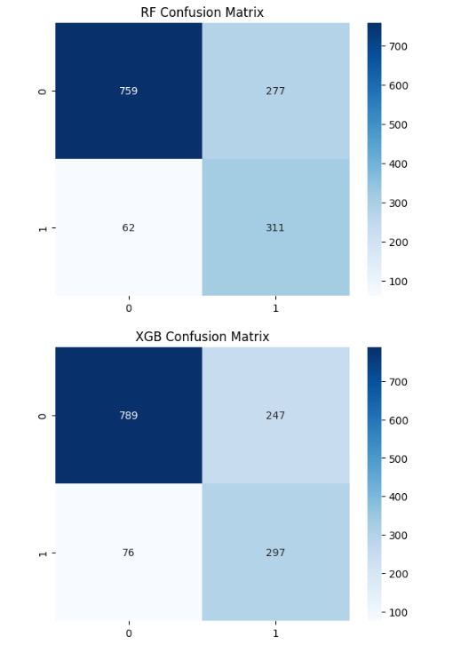
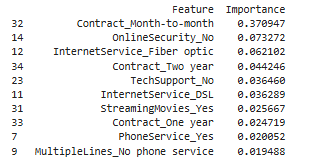
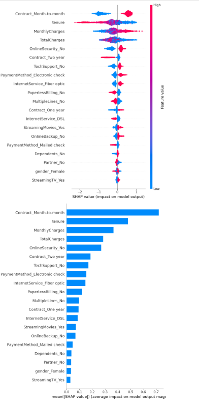

# Customer Churn Prediction

## Project Overview
Customer churn is one of the most critical challenges in subscription-based businesses. This project uses machine learning to predict whether a customer is likely to leave the company based on demographic information, account details, and service usage patterns.

The goal is to enable early identification of at-risk customers and support data-driven retention strategies and business decision-making.

---

## Dataset Description
The dataset contains customer information such as:
- Gender
- Senior Citizen Status
- Partner / Dependents
- Tenure
- Phone Service
- Internet Service
- Online Security
- Online Backup
- Device Protection
- Tech Support
- Streaming TV / Movies
- Contract Type
- Paperless Billing
- Payment Method
- Monthly Charges
- Total Charges

---

## Target Variable
- Churn = 1 → Customer left the company  
- Churn = 0 → Customer stayed  

---

## Data Preprocessing
- Handling missing values in TotalCharges  
- Converting TotalCharges to numeric format  
- Encoding categorical variables using One-Hot Encoding  
- Removing irrelevant column (customerID)  
- Train-test split (80/20)  
- Handling class imbalance using scale_pos_weight  

---

## Models Used

### 1. Random Forest (Baseline Model)
- Used for initial comparison  
- Robust ensemble method  
- Handles non-linear relationships  

### 2. XGBoost (Final Model)
- n_estimators = 500  
- max_depth = 5  
- learning_rate = 0.03  
- subsample = 0.9  
- colsample_bytree = 0.9  
- scale_pos_weight applied for class imbalance  

---

## Model Performance

### Random Forest
- Accuracy: 75.9%  
- ROC-AUC: 0.865  

| Class | Precision | Recall | F1-Score |
|------|-----------|--------|----------|
| No Churn (0) | 0.92 | 0.73 | 0.82 |
| Churn (1) | 0.53 | 0.83 | 0.65 |

---

### XGBoost (Final Model)
- Accuracy: 77.1%  
- ROC-AUC: 0.860  

| Class | Precision | Recall | F1-Score |
|------|-----------|--------|----------|
| No Churn (0) | 0.91 | 0.76 | 0.83 |
| Churn (1) | 0.55 | 0.80 | 0.65 |

---

## Model Selection
Although both models perform similarly, XGBoost was selected as the final model due to:
- Better overall accuracy
- Strong and stable performance on churn class
- Better suitability for production deployment

---

## Explainability (SHAP Analysis)

SHAP (SHapley Additive Explanations) was used to interpret the XGBoost model.

### Key Insights:
- Contract type is the most influential factor in churn prediction
- Month-to-month contracts significantly increase churn probability
- Low tenure strongly increases churn risk
- High monthly charges increase churn probability
- Online Security and Tech Support reduce churn risk

---

## Visualizations

### 1. Churn Distribution

---

### 2. Confusion Matrix

---

### 3. Feature Importance (XGBoost)

---

### 4. SHAP Summary Plot

---

## Business Insights

- Contract type is the strongest driver of churn behavior  
- Month-to-month customers are significantly more likely to churn  
- Higher monthly charges increase churn risk  
- Low tenure customers are at higher risk of early churn  
- Lack of Online Security and Tech Support increases churn probability  
- Customer behavior and service engagement are stronger predictors than demographics  

---

## Business Recommendations

- Encourage customers to move from month-to-month contracts to long-term contracts using discounts and loyalty programs  
- Focus retention strategies on new customers during their first months  
- Promote Online Security and Tech Support as bundled services  
- Investigate churn patterns among Fiber Optic users  
- Build an early churn prediction system for proactive retention campaigns  

---

## Deployment

A Streamlit web application was developed to deploy the trained XGBoost model and simulate real-world usage.

The application allows users to input customer information and instantly predict churn probability.

Live Demo:  
(https://customer-churn-prediction-jsdut4x9j6xdkwhawpszst.streamlit.app/)

This demonstrates end-to-end machine learning workflow from data preprocessing and model training to production deployment.

---
## Run on Google Colab

The project can be executed end-to-end using Google Colab for easy reproducibility:

(https://colab.research.google.com/drive/1NxO5MrNmvShHn1cbiE1Fi9gXLguE6Oxq?usp=sharing)
---

## Tools & Technologies
- Python  
- Pandas  
- NumPy  
- Matplotlib  
- Seaborn  
- Scikit-learn  
- XGBoost  
- SHAP  
- Streamlit  

---

## How to Run
1. Clone the repository  
2. Install dependencies from requirements.txt  
3. Run Jupyter Notebook or Colab  
4. Run Streamlit app using:

---

## Conclusion
This project demonstrates how machine learning can be applied to predict customer churn and support business decision-making.

The model identifies key drivers of churn such as contract type, tenure, pricing, and service engagement. These insights enable businesses to take proactive retention actions, reduce customer loss, and improve long-term revenue stability.
